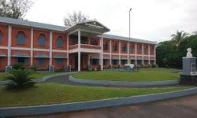

<!DOCTYPE html>
<html>
    <head>
        <title>
            Nehru Arts and Science College </title>
            <link rel="stylesheet" type="text/css" href="college.css"/>
    </head>
    <body>
            <h1>Nehru Arts and Science College Kanhagad</h1>
            

            

            <h2>About Us</h2>
            

            
Early in 1964,the enlightened public of Kanhangad and Nileshwar resolved to honour the memory of Jawaharlal Nehru,the architect of modern India by undertaking educational and cultural activities in this educationally backward area.In pursuit of this idea,a dedicated and learned team set up in 1966,an educational society known as <b>"The Nehru Memorial Education Society" </b>under the distinguished presidentship of the late<i> Shri.C.K.Nair </i>following which the society was duly registered .The establishment of Nehru Arts & Science College,Kanhangad in this backward coastal tract was the major task the society had set before themselves and had subsequently accomplished it.

            

    

    <h3>Programms Offered</h3>
        <ul style="list-style-type:disc;font-size:14px;">
       <li>B.A.Economics</li>
       <li>B.A.History</li>
       <li>B.A.Malayalam</li>
       <li>B.com</li>
       <li>B.Sc.Physics</li>
       <li>B.Sc.Mathematics</li>
       <li>B.Sc.Ploymer Chemistry</li>
       <li>B.sc.Plant Science</li>
       <li>B.Sc.Statics</li>
   

    

    <h3>Class Timings</h3>
       <ul ol type="1"; font-size:20px;">
       <li>09:30-10:30</li>
       <li>10:30-11:30</li>
       <li>11:30-12:30</li>
       <li>01:30-02:30</li>
       <li>02:30-03:30</li>
    

        </body>
</html>
